# CampusBite


CampusBite is a Java-based food ordering system designed to simplify the ordering experience for university students. The system allows users to browse campus restaurants, place orders, and pick up their meals without waiting in long queues.

> **Note:** This project was developed as a team project for the CPIT251 course.

---

## 📌 Features

- User registration and login
- Browse available restaurants
- View restaurant menus
- Add items to cart
- Place food orders
- Submit restaurant reviews
- File-based data storage

---

## 🛠️ Technologies Used

- Java
- Object-Oriented Programming (OOP)
- Maven
- File Handling
- Agile Scrum

---

## 📂 Project Structure

```
CampusBite
│
├── src/
├── pom.xml
├── menus.txt
├── users.txt
├── diagrams/
├── screenshots/
└── README.md
```

---

## 📸 User Interface

### Home Page

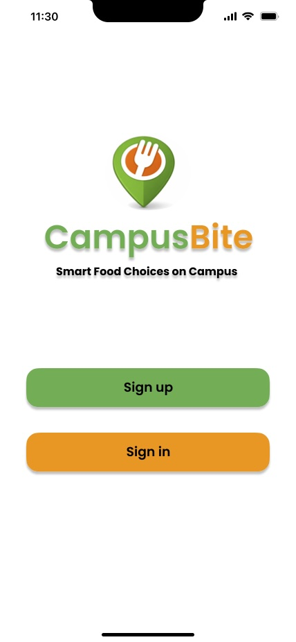
### Login Page

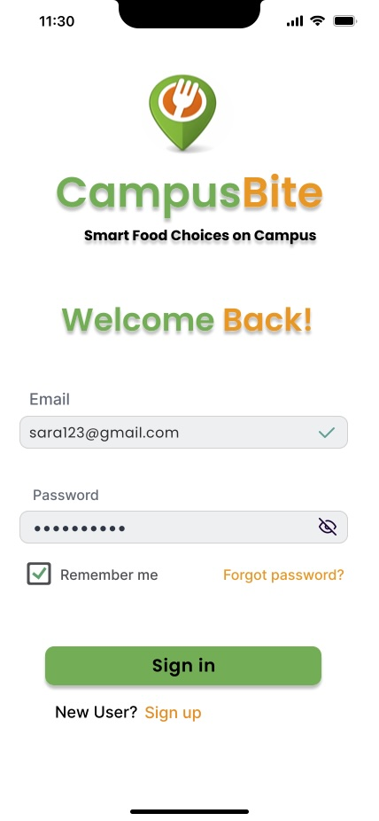

### Registration

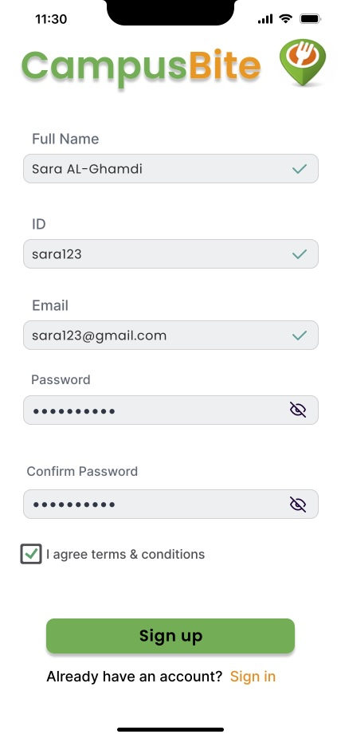

### Menu Page

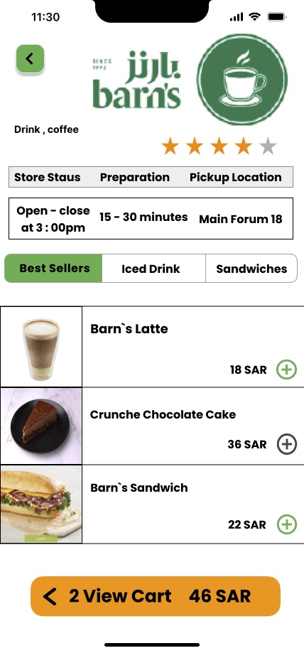

### Search Page

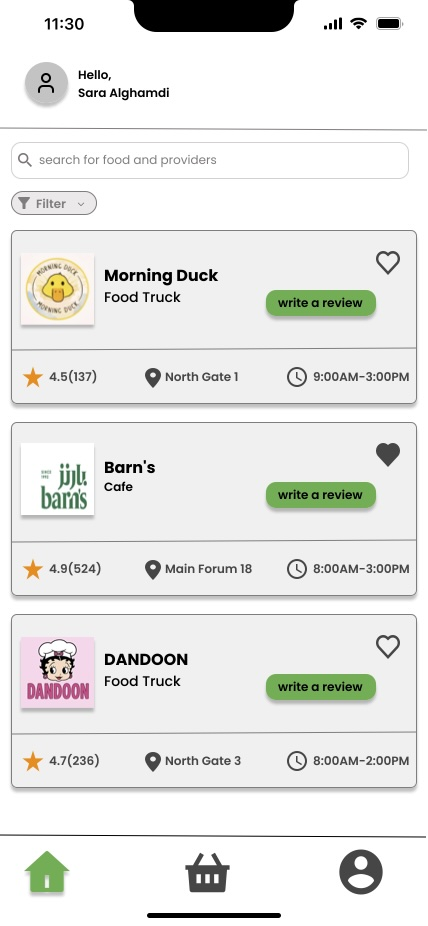

### Basket Page

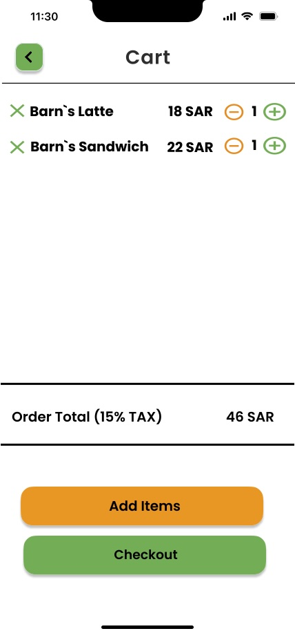

### Payment Page

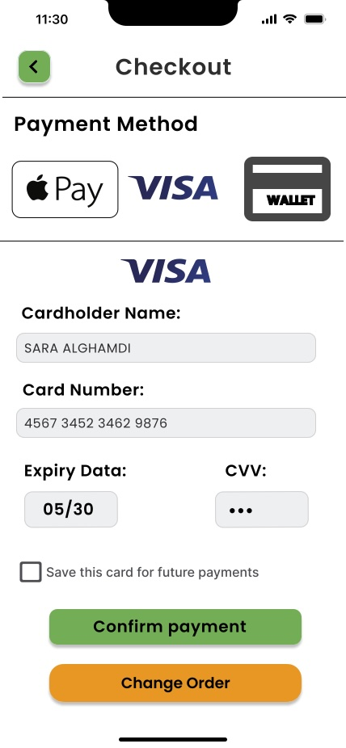

### Confirm Payment

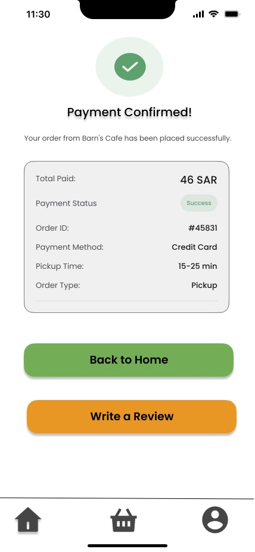

### Orders Page

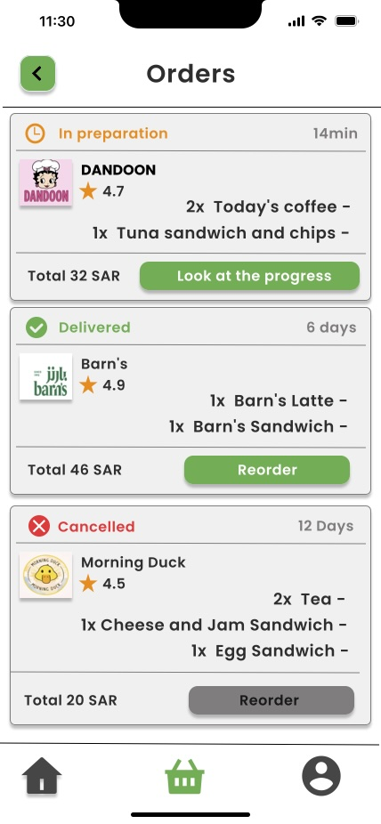

### Review Page

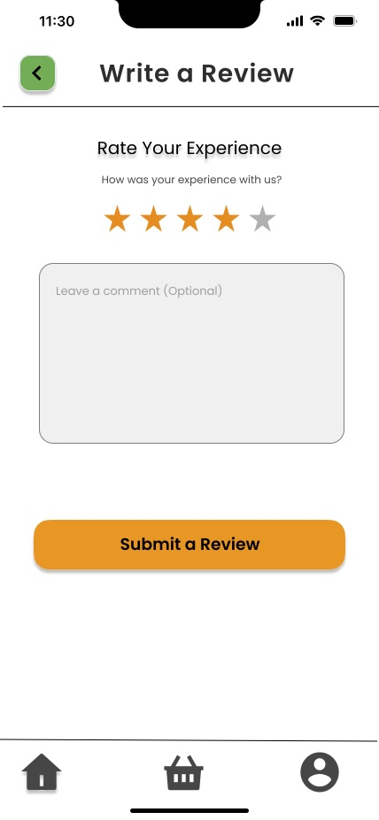

### Account Page

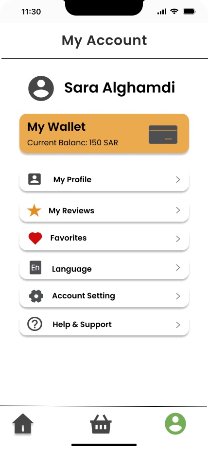
---

## 📐 System Design

The **diagrams** folder includes:

- Use Case Diagram
- Class Diagram
- Sequence Diagrams
- Architecture Diagram

---

## ▶️ How to Run

1. Clone the repository.
2. Open the project in IntelliJ IDEA or Eclipse.
3. Ensure Maven dependencies are loaded.
4. Run the application.

---

## 👥 Team Project

This project was developed collaboratively as part of a university Software Engineering course.

My contribution included participating in the analysis, implementation, testing, and documentation of the system as part of the development team.

---

## 📄 License

This repository is published for portfolio and educational purposes only.
